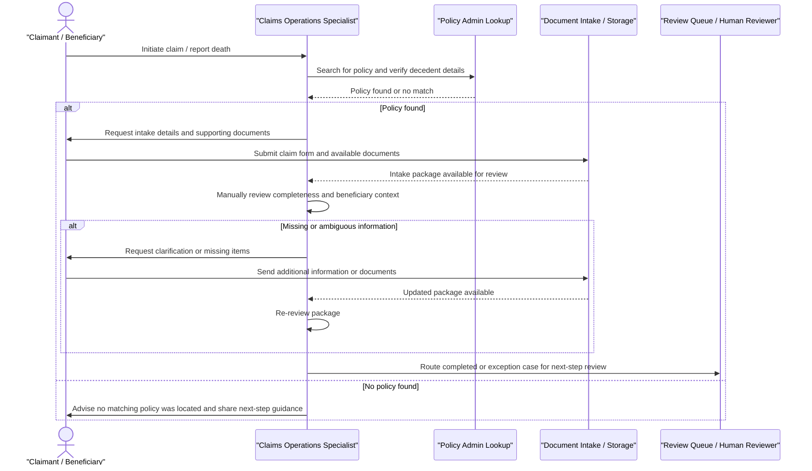
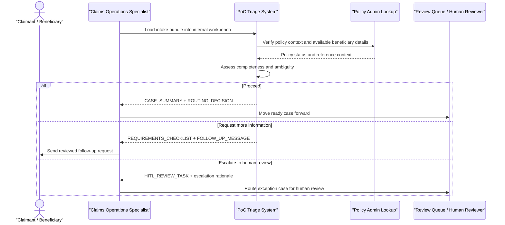

# Death Claim Process Understanding

## Purpose

This document captures the current-state process understanding and the PoC-improved flow for the selected death-claim intake slice. Its goal is to make the research claim in [PLAN.md](../../PLAN.md) explicit and reusable in both implementation planning and the final demo narrative.

## Research Basis and Assumptions

This is a generalized life-insurance death-claim intake flow synthesized from public carrier and regulator materials checked on March 9, 2026.

Public research inputs used here:

- [Bestow claims page](https://app.bestow.com/customer/file-a-claim): public claim-intake flow, policy search, beneficiary packet, and required follow-up steps
- [New York Life: Start a claim](https://www.newyorklife.com/claims/start-a-claim): intake information requested, additional documentation, and beneficiary follow-up behavior
- [Guardian: Initiate a death claim](https://customeraccess.guardianlife.com/im-user/claims/death): beneficiary details and supporting-document expectations
- [Northwestern Mutual: Report a death](https://www.northwesternmutual.com/report-a-death/): death-report intake and optional supporting-document submission
- [NAIC Life Insurance Policy Locator](https://content.naic.org/article/learn-how-use-naic-life-insurance-policy-locator): policy-discovery path when policy details are unknown

Working assumptions:

- Carrier-specific claims operations vary, but the intake pattern is stable enough to model as: claim notice, policy/decedent verification, document capture, completeness review, follow-up, and routing
- Some carriers split the workflow into an initial notice followed by a claim packet; this PoC compresses that into an internal intake-plus-triage view
- The PoC models only the intake and completeness-triage slice, not downstream settlement, adjudication, or payout operations

## Stakeholders

- `Claims operations specialist`: primary internal user responsible for reviewing intake, identifying missing information, and deciding next-step routing
- `Claimant or beneficiary`: external party reporting the death, providing identifying details, and responding to follow-up requests
- `Downstream human reviewer / exception handler`: receives ambiguous or non-straight-through cases for additional review
- `Policy admin lookup`: supporting system used to verify that a policy exists and to retrieve basic policy context
- `Document intake / storage`: supporting system that stores intake forms and supporting documents
- `Review queue`: supporting work queue where ready or escalated cases move after intake triage

## Current-State Process

## Current-State Step Breakdown

| Step                    | Primary actor                                            | Touchpoint / system                       | What happens                                                                        | Where friction appears                                                                       |
|-------------------------|----------------------------------------------------------|-------------------------------------------|-------------------------------------------------------------------------------------|----------------------------------------------------------------------------------------------|
| 1. Claim initiated      | Claimant or beneficiary                                  | Phone, web form, or service rep           | A death is reported and basic decedent information is provided                      | External party may not know the policy number, beneficiary status, or exact required details |
| 2. Policy lookup        | Claims operations specialist                             | Policy admin lookup                       | Claims ops verifies that a policy exists and matches the reported decedent          | Policy identification can be manual or incomplete when the caller lacks policy details       |
| 3. Intake captured      | Claimant or beneficiary                                  | Claim form and document intake            | Initial claim details and any available documents are submitted                     | Supporting documents may be partial, inconsistent, or delayed                                |
| 4. Completeness review  | Claims operations specialist                             | Internal claims review process            | Claims ops checks whether the intake package is sufficient to move forward          | Review logic can be inconsistent and distributed across notes, forms, and policy context     |
| 5. Follow-up loop       | Claims operations specialist and claimant or beneficiary | Email, phone, portal, or mail             | Missing or unclear items trigger manual outreach and another submission round       | Back-and-forth is slow, repetitive, and can be difficult for bereaved claimants              |
| 6. Route to next review | Claims operations specialist                             | Review queue / downstream claims handling | Case is routed for further review once it is complete enough or clearly exceptional | Downstream reviewers may receive unevenly prepared cases with thin rationale                 |

## Known Pain Points

| Pain point                                                     | Affected stakeholder                                 | Where it appears                      | Why it matters                                                                    |
|----------------------------------------------------------------|------------------------------------------------------|---------------------------------------|-----------------------------------------------------------------------------------|
| Required information is not obvious at intake time             | Claimant or beneficiary                              | Claim initiation and early intake     | Increases incomplete submissions and emotional friction during a sensitive moment |
| Policy and beneficiary context must be assembled manually      | Claims operations specialist                         | Policy lookup and completeness review | Slows triage and creates avoidable manual synthesis work                          |
| Missing or ambiguous items create repeated follow-up loops     | Both                                                 | Follow-up loop                        | Delays claim progression and increases operational touch count                    |
| Next-step rationale is often implicit rather than explicit     | Claims operations specialist and downstream reviewer | Completeness review and routing       | Makes handoffs uneven and harder to audit or explain                              |
| Straightforward and exception cases can look similar too early | Claims operations specialist                         | Routing decision                      | Causes either over-escalation or rework when ambiguity is discovered later        |

## Constraints and Guardrails

- The PoC must not adjudicate the claim or determine benefit eligibility
- The PoC must not imply autonomous payout or benefits determination
- Human review boundaries must remain explicit for ambiguous or exception cases
- Claimant or beneficiary communication must be handled with an empathetic, operationally appropriate tone
- Policy discovery and beneficiary validation can be incomplete at first notice, so the intake process must tolerate partial information

## Improvement Thesis

The PoC improves this workflow by turning raw intake artifacts into an explicit triage step for claims ops: the system assesses completeness, highlights ambiguity, recommends one bounded next step, and produces the operational artifacts needed to move the case forward without replacing regulated human judgment.

## PoC-Assisted Flow

## Pain Point to Improvement Mapping

| Pain point                                                     | PoC intervention                                                         | Expected artifact / output |
|----------------------------------------------------------------|--------------------------------------------------------------------------|----------------------------|
| Required information is not obvious at intake time             | Make completeness rules visible and specific to the intake bundle        | `REQUIREMENTS_CHECKLIST`   |
| Policy and beneficiary context must be assembled manually      | Normalize intake plus policy context into a concise internal triage view | `CASE_SUMMARY`             |
| Missing or ambiguous items create repeated follow-up loops     | Generate a focused next-step request instead of ad hoc manual outreach   | `FOLLOW_UP_MESSAGE`        |
| Next-step rationale is often implicit rather than explicit     | Produce an explicit disposition for proceed vs follow-up vs escalation   | `ROUTING_DECISION`         |
| Straightforward and exception cases can look similar too early | Create a bounded escalation path when ambiguity remains                  | `HITL_REVIEW_TASK`         |

## PoC Scope Boundary

In scope:

- Internal claims-ops workbench for intake review
- Intake + completeness triage
- Generated follow-up artifacts for missing or unclear information
- Bounded escalation to human review for ambiguous cases

Out of scope:

- Full claims lifecycle beyond intake triage
- Claim adjudication
- Benefit determination or payout decisions
- End-customer self-service product beyond the generated follow-up artifacts
