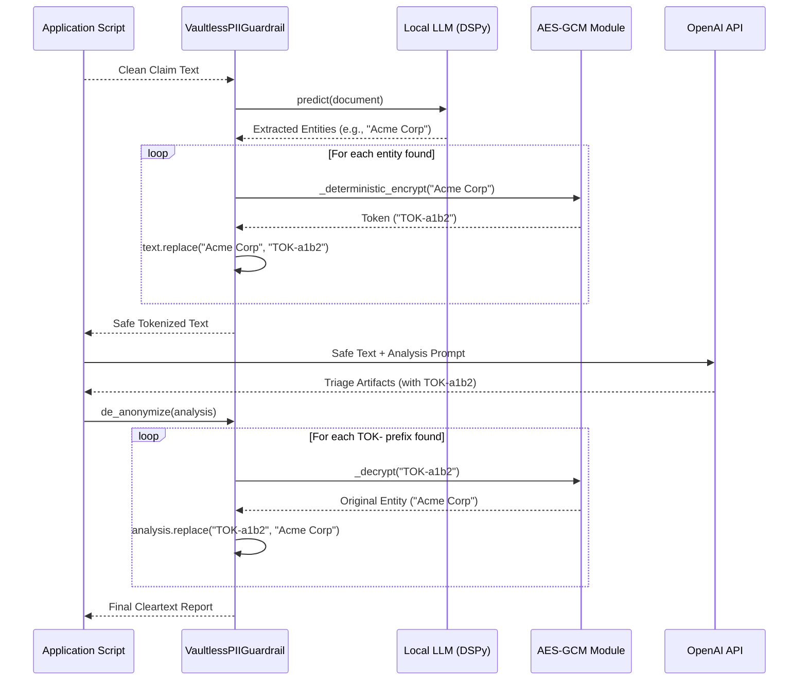
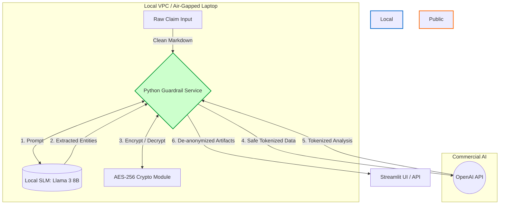

# Enterprise AI PII Guardrail Architecture

This document outlines the architecture, toolchain, and cost analysis for a zero-data-leakage AI pipeline. This system extracts Personally Identifiable Information (PII) from enterprise documents using local SLMs, encrypts it using Format-Preserving Encryption (FPE) concepts, and securely orchestrates analysis via commercial APIs. This serves as the blueprint for the DSPy Guardrail stretch goals.

---

## 1. Toolchain & Stack

| Category            | Tool                       | Purpose                                                                            |
|:--------------------|:---------------------------|:-----------------------------------------------------------------------------------|
| **Orchestration**   | `DSPy`                     | Framework for programmatically defining and optimizing the LLM extraction prompts. |
| **Local Inference** | `Ollama` / `LM Studio`     | Engine to run the Small Language Model (SLM) locally on a laptop or VPC.           |
| **Local SLM**       | `Llama 3.1 (8B)` / `Phi-3` | The open-weight model tasked strictly with Named Entity Recognition (NER).         |
| **File Parsing**    | `Unstructured` / `Docling` | Local extraction of text/Markdown from complex formats (PDF, DOCX, XLSX).          |
| **Cryptography**    | `cryptography (AESGCM)`    | Standard Python library for deterministic authenticated encryption of PII.         |
| **Agentic AI API**  | `OpenAI API`               | The commercial API used for the heavy lifting (triage analysis) on the safe text.  |

---

## 2. Python Functions & Classes Created

* **`ExtractPII (dspy.Signature)`**: Defines the input/output expectations for the local LLM.
* **`pii_metric(example, pred)`**: The custom evaluation metric focused strictly on **Recall** (penalizing false negatives) used by the DSPy teleprompter.
* **`VaultlessPIIGuardrail`**: The production-grade, cryptographically deterministic implementation.
  * `_deterministic_encrypt(plaintext)`: Hashes PII to create a consistent nonce, returning a safe `TOK-` base64 string.
  * `_decrypt(token)`: Mathematically reverses the token back to cleartext using the secret key.
  * `anonymize(text)`: Orchestrates the DSPy extraction and text replacement.
  * `de_anonymize(agent_output)`: Scans for tokens and reverses them post-analysis.

---

## 3. Python Call Chain Sequence

This diagram shows the exact programmatic flow of data within your Python application during a single execution.

---

## 4. System Architecture

This architectural flow demonstrates how compute is distributed to maximize security while leveraging commercial reasoning capabilities.

---

## 5. Cost Estimation Model

Because the extraction and tokenization are handled by your local SLM, the **cost for the PII guardrail is $0.00**. You only pay API costs for the final agentic analysis.

### Cost Formula

Use this formula to estimate costs based on OpenAI's pricing structure:
`Total Cost = [(Input Tokens / 1,000,000) * Input Rate] + [(Output Tokens / 1,000,000) * Output Rate]`

### Standardized Scenario Table

*Assuming an average financial document contains **30,000 input tokens** (~45 pages) and requires an analysis output of **1,000 tokens**.*

| Volume              | Total Input Tokens | Total Output Tokens | GPT-4o Cost | GPT-4o mini Cost | Guardrail Cost |
|:--------------------|:-------------------|:--------------------|:------------|:-----------------|:---------------|
| **1 Document**      | 30,000             | 1,000               | **$0.165**  | **$0.0051**      | **$0.00**      |
| **100 Documents**   | 3,000,000          | 100,000             | **$16.50**  | **$0.51**        | **$0.00**      |
| **1,000 Documents** | 30,000,000         | 1,000,000           | **$165.00** | **$5.10**        | **$0.00**      |

*Current API Pricing (per 1M tokens):*

* *GPT-4o: $5.00 Input / $15.00 Output*
* *GPT-4o-mini: $0.15 Input / $0.60 Output*

---

## 6. Local Model Selection & Hardware

For Named Entity Recognition (NER) and PII extraction, you do not need a massive, compute-heavy model. By using DSPy to optimize the prompt, a Small Language Model (SLM) running locally will achieve enterprise-grade accuracy.

### Recommended Local Models (3B to 9B Parameters)

* **Llama 3.1 (8B) or Llama 3.2 (3B):** Meta's smaller models follow structural instructions (like DSPy signatures) exceptionally well.
* **Phi-3 Mini (3.8B):** Microsoft built this model specifically to punch above its weight class in logic and extraction.
* **Qwen 2.5 (7B):** Currently one of the strongest open-source models in this size class for strict formatting and data extraction.

---

## 7. Foundational Concepts: Hashing vs. Redaction

When securing documents for agentic workflows, traditional redaction (`[REDACTED]`) is insufficient.

* **The Problem with Redaction:** Replacing entities with `[REDACTED]` destroys the relational logic the LLM needs to perform analysis (e.g., distinguishing between Company A and Company B in a document).
* **The Solution (Pseudonymization):** By hashing unique values deterministically (mapping "Company A" to `TOK-a1b2`), the agent can track distinct actors throughout the workflow to perform accurate analysis, and the system can seamlessly reverse the tokens to cleartext before presenting the final output.

---

## 8. Security Guardrail Tuning: Recall vs. Precision

When defining the evaluation metric for the DSPy optimizer, **Recall** is vastly more important than **Precision**.

* **False Positives (Low Precision):** If the model accidentally flags "Apples" as a sensitive company name, the document reads "TOK-1234 are delicious." This is slightly annoying, but safe.
* **False Negatives (Low Recall):** If the model misses "John Doe", you have a data breach.
* **The Metric Design:** The `pii_metric` function is designed to heavily penalize the model (score = 0.0) if it misses *any* ground-truth entity, forcing the DSPy compiler to learn that missing PII is unacceptable.

---

## 9. Tokenization Architecture Patterns

1. **Vaultless (Format-Preserving Encryption) [Chosen Pattern]:**
   * *Mechanism:* Uses cryptographic keys (AES-GCM) to mathematically derive tokens from the PII.
   * *Use Case:* Enterprise scale, massive parallel processing.
   * *Advantage:* Infinitely scalable, reversible without a lookup table, and allows anonymization/de-anonymization to occur on entirely different servers.

---

## 10. Handling Specific File Formats & "Gotchas"

* **PDFs (The Bounding Box Problem):** Because PDFs rely on exact X/Y coordinate layouts, replacing "John Doe" with `TOK-a1b2c3d4` will often cause text to overlap or break the visual layout. The production solution is to use parsers to convert the PDF to raw Markdown, run the analysis on the Markdown, and abandon the original visual PDF layout.
* **The Regex De-Anonymization Gotcha:** Because Vaultless tokenization relies on regex (`TOK-[a-zA-Z0-9_\-]+`) to find tokens in the final LLM output, you must ensure your agentic prompt instructs the LLM *not* to alter or drop characters from the token strings. A mangled string will fail decryption.
